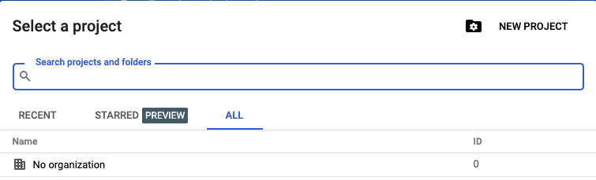
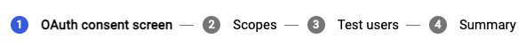
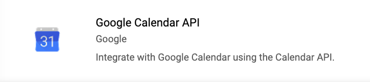
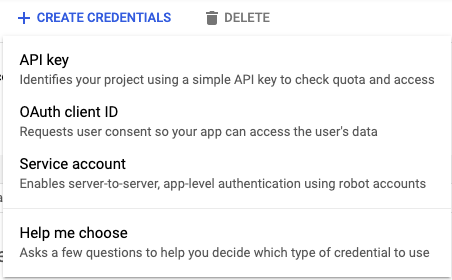
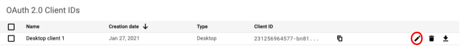

# Schoology-Google Calendar Integration
Add assignments from a class to google calendar in a single command.

## Setup
Go to your [google developer console](https://console.cloud.google.com/). Click <kbd>Select a Project</kbd> on the top left of the screen and <kbd>New Project</kbd>

Name your project.

Click <kbd>OAuth consent screen</kbd> and create a consent screen. Name your app, and add your email. For steps 2-4, you can just click "save and continue".

Click <kbd>dashboard</kbd> and <kbd>Enable APIs and services</kbd> and enable "Calendar API".

Now click [<kbd>Credentials</kbd>](https://console.cloud.google.com/apis/credentials) on the left menu. Click <kbd>Create Credentials</kbd> and <kbd>OAuth Client ID</kbd>.

Select "Desktop App" and name the app.
After creating the app, you can now download the credentials file from your credentials page.

Now clone this repository and `cd` to it.

    $ git clone https://github.com/Harker-Hackers/schoology-gcalendar-backup
    $ cd schoology-gcalendar-backup

To login:

    $ python3 sc-calendar [client secret file]

Replace `[client secret file]` with the downloaded file from the developer console. \
This should open a browser. Login to your google account.

Head to `[your school's schoology URL]/api`

Now edit [`schoology.json`](schoology.json) with your key and secret. Add your classes you want to have assignments added's ID.

You are now setup!

## Usage

Run `sc-calendar push`, and your assignments from the next 12 days will be added to Google Calendar!